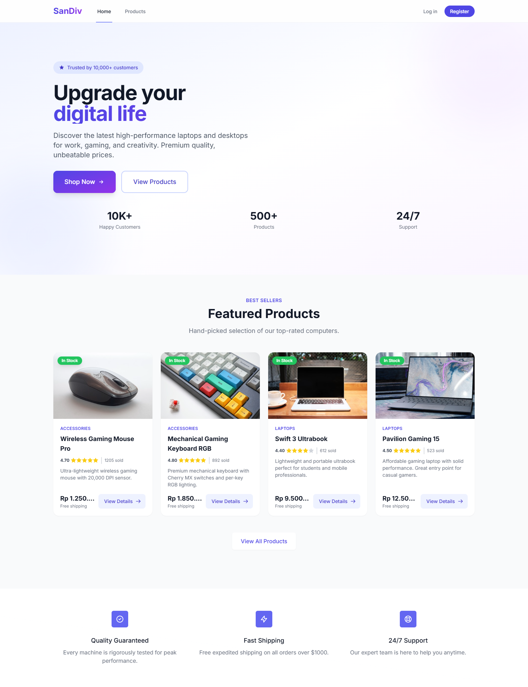
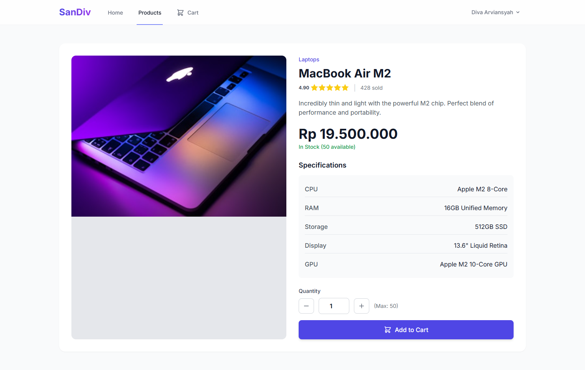
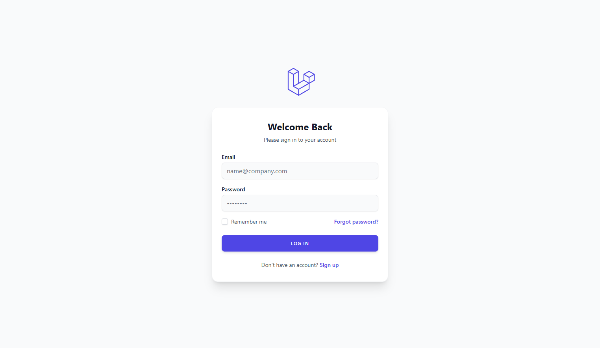
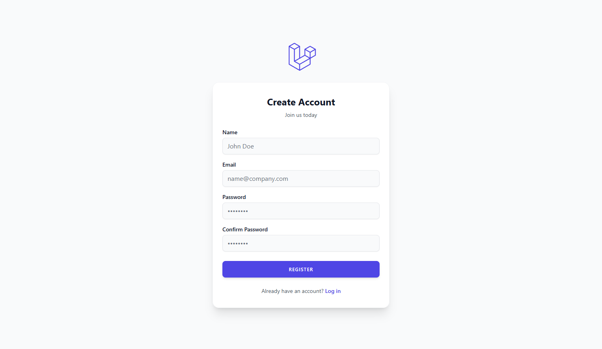

<div align="center">

# 🛍️ Modern E-Commerce

[](https://laravel.com)
[](https://tailwindcss.com)
[](https://www.php.net)
[](LICENSE)

**A complete, modern shopping experience built with performance and aesthetics in mind.**

[View Demo](#) · [Report Bug](#) · [Request Feature](#)

</div>

---

## 📋 About The Project

This application is a robust E-Commerce platform designed to provide a seamless shopping experience. Built on the powerful **Laravel 12** framework and styled with **TailwindCSS**, it offers a responsive, fast, and user-friendly interface for both customers and administrators.

### ✨ Key Features

-   🛍️ **Product Browsing**: Intuitive product grid with detailed views.
-   🛒 **Shopping Cart**: Real-time cart management.
-   📦 **Order Processing**: Complete order lifecycle from placement to completion.
-   👥 **Role-Based Access**: Distinct panels for **Admin** (management) and **User** (shopping).
-   💳 **Payment Integration**: Support for various payment statuses and methods.
-   📱 **Responsive Design**: Optimized for mobile, tablet, and desktop.

---

## 📸 Screenshots

<div align="center">

| **Home Page** | **Product Detail** |
|:---:|:---:|
|  |  |
| **Login Page** | **Register Page** |
|  |  |

</div>

---

## 🚀 Getting Started

Follow these simple steps to get a local copy up and running.

### Prerequisites

Ensure you have the following installed:
*   **PHP** >= 8.2
*   **Composer**
*   **Node.js** & **NPM**
*   **MySQL**

### 💿 Installation

1.  **Clone the repository**
    ```bash
    git clone https://github.com/SanDiv-eL/SanDiv-eL.git
    cd SanDiv-eL
    ```

2.  **Install Dependencies**
    ```bash
    composer install
    npm install
    ```

3.  **Configure Environment**
    ```bash
    cp .env.example .env
    ```
    Update `.env` with your database credentials:
    ```env
    DB_CONNECTION=mysql
    DB_HOST=127.0.0.1
    DB_PORT=3306
    DB_DATABASE=ecommerce
    DB_USERNAME=root
    DB_PASSWORD=
    ```

4.  **Generate Key & Setup Database**
    ```bash
    php artisan key:generate
    php artisan migrate --seed
    ```
    > **Note**: The `--seed` command populates the database with demo data and default accounts.

5.  **Run the Application**
    Start the development servers in two separate terminals:
    ```bash
    # Terminal 1
    npm run dev

    # Terminal 2
    php artisan serve
    ```
    Access the app at `http://localhost:8000`.

---

## 🔐 Login Credentials

Use these pre-configured accounts to explore the application.

| Role | Email | Password | Permissions |
| :--- | :--- | :--- | :--- |
| **👑 Admin** | `admin@ex.com` | `12345678` | Dashboard access, Product management, Order oversight. |
| **👤 User** | `user@ex.com` | `12345678` | Browse products, Add to cart, Place orders. |

---

## 🗄️ Database Structure

The application data is organized into the following core tables:

### 👤 `users`
| Column | Type | Description |
| :--- | :--- | :--- |
| `id` | PK | Unique identifier |
| `name` | String | User's full name |
| `email` | String | Unique email address |
| `email_verified_at` | Timestamp | Email verification timestamp (Nullable) |
| `password` | String | Hashed password |
| `role` | String | `admin` or `user` (Default: `user`) |
| `remember_token` | String | "Remember me" token |
| `created_at` | Timestamp | Creation timestamp |
| `updated_at` | Timestamp | Last update timestamp |

### 🏷️ `categories`
| Column | Type | Description |
| :--- | :--- | :--- |
| `id` | PK | Unique identifier |
| `name` | String | Category name |
| `slug` | String | URL-friendly name (Unique) |
| `description` | Text | Category description (Nullable) |
| `created_at` | Timestamp | Creation timestamp |
| `updated_at` | Timestamp | Last update timestamp |

### 📦 `products`
| Column | Type | Description |
| :--- | :--- | :--- |
| `id` | PK | Unique identifier |
| `category_id` | FK | Linked Category |
| `name` | String | Product name |
| `slug` | String | URL-friendly name (Unique) |
| `description` | Text | Product description |
| `price` | BigInt | Price in Rupiah (Unsigned) |
| `stock` | Integer | Available quantity (Default: 0) |
| `rating` | Decimal | Product rating (3,2) (Default: 0.00) |
| `sold_count` | Integer | Number of units sold (Default: 0) |
| `image` | String | Path to product image (Nullable) |
| `specifications` | JSON | Technical specs (CPU, RAM, etc.) |
| `created_at` | Timestamp | Creation timestamp |
| `updated_at` | Timestamp | Last update timestamp |

### 🧾 `orders`
| Column | Type | Description |
| :--- | :--- | :--- |
| `id` | PK | Unique identifier |
| `user_id` | FK | Customer |
| `total_price` | BigInt | Grand total (Unsigned) |
| `status` | String | `pending`, `processing`, `completed`, `cancelled` |
| `payment_status`| String | `unpaid`, `paid` |
| `payment_method`| String | Payment method used (Nullable) |
| `shipping_address`| Text | Full shipping address |
| `created_at` | Timestamp | Creation timestamp |
| `updated_at` | Timestamp | Last update timestamp |

### 🛒 `order_items`
| Column | Type | Description |
| :--- | :--- | :--- |
| `id` | PK | Unique identifier |
| `order_id` | FK | Linked Order |
| `product_id` | FK | Linked Product |
| `quantity` | Integer | Quantity purchased |
| `price` | BigInt | Price at time of purchase (Unsigned) |
| `created_at` | Timestamp | Creation timestamp |
| `updated_at` | Timestamp | Last update timestamp |

---

## 🛠️ Tech Stack

*   **Framework:** [Laravel 12](https://laravel.com)
*   **Styling:** [TailwindCSS](https://tailwindcss.com)
*   **Templating:** Blade
*   **Database:** MySQL